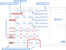
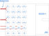

============================
Electrical design
============================

Overall concept
=========================

Plug-in units are interconnected with a backplane mounted on the rear horizontal rails within the subrack.
Power to the backplane is provided using bidirectional/source units from their respective front panels.
Data communication and any field connections are only done on plug-in unit front panels.

Backplane interconnects
=============================

The backplane provides redundant low power rails, a high power rail, redundant ``nqdaq-nbus`` communication
buses, ``nwdaq-pbus`` power resource communication bus, 10Base-T1S multidrop ethernet bus and 100Base-T1/1GBase-T1
point-to-point links. WIth the exception of the last one, all interconnections are using the bus topology.
Point-to-point ethernet links use star topology, more on that in the corresponding section. There are no external
connections going to the backplane except connections allowing backplane stacking.

All connections are organized into 8 possible backplane connectors with designations JM0 to JM7. The following
table lists all connections within the particular backplane connector.

.. table:: List of backplane connectors with their respective interconnects

	=============== ========================== =================================================================
	Connector       Name                       Interconnects
	=============== ========================== =================================================================
	JM0             Basic power and data       - VBUS_LP low power bus
	                                           - ``nwdaq-nbus`` communication bus
	                                           - 10Base-T1S ethernet bus
	                                           - card detect input/output
	                                           - chassis ground connection
	JM1		Redundant power and data   - VBUS_LP2 low power bus
	                                           - ``nwdaq-nbus`` redundant communication bus
	                                           - 100Base-T1/1GBase-T1 ethernet link
	JM2             App specific, star         Application-specific fanout of 10 differential lanes,
 	                                           connections to the other units are given by the backplane design.
	                                           See JM2 addendums for commonly used connections.
	JM3             Reserved
	JM3             Reserved
	JM3             Reserved
	JM3             Reserved
	JM3             High power bus             - VBUS_HP high power bus
	                                           - ``nwdaq-pbus`` power resource bus
	                                           - card detect input/output
	                                           - chassis ground connection
	=============== ========================== =================================================================

Redundant data connection over ``nwdaq-nbus``
------------------------------------------------

``nwdaq-nbus`` satisfies the following requirements:

- very low power during the idle state
- moderate speeds achievable (1-4 mbit/s on the backplane, 250 kbit/s nominally over long runs)
- initiator driven MAC (token passing) or CSMA/CA/CD MAC
- wired-OR operation to avoid power peaks during collisions
- source-based addressing (publish/subscribe)
- packet-switched
- native encryption using pre-shared keys providing basic security
- packet size up to 1024 B

On the **physical layer** (L1) level, the bus uses CAN signalling as specified in ISO 11898-2. Common CAN and CAN-FD
transceivers can be used to access the ``nwdaq-nbus`` bus. CAN MAC is not used.

.. note::

	There is also a legacy possibility of tunneling ``nqdaq-nbus`` over a CAN 2.0b bus. This concept is not part
	of this specification as it is no longer recommended nor used.

Redundant low power bus ``VBUS_LP`` and ``VBUS_LP2``
--------------------------------------------------------

High power bus ``VBUS_HP``
----------------------------------

Ethernet data connection over 10Base-T1S
---------------------------------------------

Ethernet data connection over 100Base-T1/1GBase-T1
-----------------------------------------------------

Application specific differential lanes
--------------------------------------------

Backplane connector pinouts
==================================

Backplane contains slots for 8 connectors named JM0 to JM7. Not all of them need to be used. These are the
usual combinations:

- JM0 only - for simple units, no requirement for redundancy
- JM1 only - not possible
- JM0+JM1 - redundant low power bus and redundant communication bus
- JM0+JM1 - simple units with fast data transfer requirement (100Base-T1/1GBase-T1)
- +JM2 - ethernet switching boards, USB hub boards, etc.
- JM7 only - high power units, photovoltaic input units, battery packs
- JM0+JM7 - power supplies, external power bus interfaces

JM0
-------------------

JM0 connector provides power and data for simple and low power units usually in the 1-3 power class.
No power or communication redundancy is available if only JM0 is used. Signal placement on the connector
is optimized to allow using PCBs made with simple processes, 2 or 4 layer.

	Backplane connector pinout and suggested routing - JM0

.. table:: JM0 backplane connector signal description

	========== ====================================================
	Signal     Description
	========== ====================================================
	CD         Card detect. Connect resistor to GND or VBUS_LP.
		   See `card-detection` section.
	CH         Chassis ground. See `grounding-concept`.
	GND        Plug-in unit main ground connection.
	VBUS_LP    Lopw-power bus connection
	T1SP       10Base-T1S bus, positive
	T1SN       10Base-T1S bus, negative
	NBUSP      ``nqdaq-nbus`` bus, positive
	NBUSN      ``nqdaq-nbus`` bus, negative
	========== ====================================================

JM1
------------------

JM1 connector provides redundant ``VBUS_LP`` power and ``nwdaq-nbus`` data communication. For units with
higher data transfer requirements, 100Base-T1/1GBase-T1 interface is available.

	Backplane connector pinout and suggested routing - JM1

.. table:: JM1 backplane connector signal description

	========== ====================================================
	Signal     Description
	========== ====================================================
	========== ====================================================

JM2
-----------------

.. figure:: _static/jm2.svg
	:width: 400pt

	Backplane connector pinout and suggested routing - JM2

.. table:: JM2 backplane connector signal description

	========== ====================================================
	Signal     Description
	========== ====================================================
	========== ====================================================

JM7
-----------------

	Backplane connector pinout and suggested routing - JM7

.. table:: JM7 backplane connector signal description

	========== ====================================================
	Signal     Description
	========== ====================================================
	========== ====================================================

Unit power sinking/sourcing considerations
================================================

.. note::

	Describe requirements for power filtering, maximum power levels, hot-plug/unplug management, etc.

