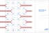

============================
Electrical design
============================

Overall concept
=========================

Plug-in units are interconnected with a backplane mounted on the rear horizontal rails within the subrack.
Power to the backplane is provided using bidirectional/source units from their respective front panels.
Data communication and any field connections are only done on plug-in unit front panels.

Backplane connections
=============================

The backplane provides redundant low power rails, a high power rail, redundant ``nqdaq-nbus`` communication
buses, ``nwdaq-pbus`` power resource communication bus, 10Base-T1S multidrop ethernet bus and 100Base-T1/1GBase-T1
point-to-point links. WIth the exception of the last one, all interconnections are using the bus topology.
Point-to-point ethernet links use star topology, more on that in the corresponding section. There are no external
connections going to the backplane except connections allowing backplane stacking.

As a result, ``nwdaq-r3`` platform backplane can be fully passive. There are no mandatory components on the backplane
except:

- ``nwdaq-nbus2`` bus termination (both ends)
- 10Base-T1S bus termination (both ends)
- ``nwdaq-pbus`` pull-up resistor

All connections are organized into 8 backplane connectors with designations JM0 to JM7. The following
table lists all connections within the particular backplane connector.

.. table:: List of backplane connectors with their respective usage

	=============== ========================== =================================================================
	Connector       Name                       Description
	=============== ========================== =================================================================
	JM0             Basic power and data       Contains the required minimum for a unit. It carries ``VBUS_LP``
	                                           low power bus, ``nwdaq-nbus2`` communication bus, 10Base-T1S
	                                           ethernet bus, card detect input/output, chassis ground connection.
	JM1		Redundant power and data   This is a redundancy and data speed extension. It carries
	                                           an independent ``VBUS_LP2`` low power bus, an independent redundant
	                                           ``nwdaq-nbus2`` communication bus and a 100Base-T1/1GBase-T1
	                                           point-to-point ethernet link (the actual connected target
	                                           depends on the backplane design).
	JM2             App specific, star         Application-specific fanout of 10 differential lanes,
 	                                           connections to other units are dictated by the backplane design.
	                                           See JM2 addendums for commonly used connections.
	JM3             Reserved
	JM3             Reserved
	JM3             Reserved
	JM3             Reserved
	JM3             High power bus             Carries signals and buses for high power units. ``VBUS_HP`` high
	                                           power bus capable of delivering ``10 A`` at ``28.8 V`` maximum,
	                                           ``nwdaq-pbus`` power resource bus, card detect input/output and
	                                           a chassis ground connection.
	=============== ========================== =================================================================

The following subsections briefly describe all available power and data buses.

``nwdaq-nbus2`` data bus
------------------------------------------------

``nwdaq-nbus`` is designed with the following constraints and requirements in mind:

- very low power during the idle state with commonly available CAN bus transceivers
- moderate speeds achievable (1-4 mbit/s on the backplane, 250 kbit/s nominally over long runs)
- initiator driven MAC (token passing) or CSMA/CA/CD MAC
- wired-OR operation to avoid power peaks during collisions
- source-based communication using topics to mimic MQTT (publish/subscribe) or request/response
  communication to follow the RPC concept
- packet-switched
- native encryption using pre-shared keys providing basic security on the MAC level
- packet size up to 1024 B (this limit is TBD)

On the **physical layer** (L1) level, the bus uses ``CAN`` signalling as specified in ISO 11898-2.
Common CAN transceivers can be used to access the ``nwdaq-nbus2`` bus. CAN MAC is not used.

Detailed description of the ``nwdaq-nbus2`` protocol on the MAC and higher levels can be found in the
corresponding section `nwdaq-nbus2`.

.. note::

	There is also a legacy possibility of tunneling ``nqdaq-nbus`` over a CAN 2.0b bus. This concept is not part
	of this specification as it is no longer recommended nor used.

``VBUS_LP`` and ``VBUS_LP2`` low power bus
--------------------------------------------------------

``VBUS_LP`` buses carry ``5 V`` power to plug-in units, ``4 A`` maximum per unit. The total aggregated backplane
current is limited to ``8 A``. The bus uses its voltage to communicate the current available amount of power
in total. It is called ``power-availability``, where ``pa--`` state means the shortage is
long lasting, all backup resources are deprived and power failure is imminent, ``pa-`` is the common state when eg.
running on batteries, ``pa0`` means the energy sinking/sourcing is in balance, ``pa+`` means there is a surplus of
energy available (eg. to charge backup batteries) but the amount of energy is limited, ``pa++`` means there is a
power source with virtually infinite capacity (an AC connection for example).

``pa0`` is always at the nominal bus voltage level, ``5 V`` for ``VBUS_LP``. ``pa-`` and ``pa--`` are 5% and 10% less
tha nominal, respectively. ``pa+`` and ``pa++`` are 5% and 10% more than nominal. There is a +-2.5% tolerance on the
voltage levels, that is, ``pa-`` being -7.5% to -2.5% lower than the nominal voltage, for example.

Voltage levels lower than 7.5% less than the nominal voltage are considered bus undervoltage and must trigger
plug-in units ``UVLO`` protection disconnecting the units from the bus.

Voltage levels higher than nominal + 7.5% are considered overvoltage and all units must deal with it individually by
cutting the bus off (an ``OVP`` protection).

Additionally, all sinking units must limit their current sink to the value specified in the corresponding unit
datasheet, no more than ``4 A``, which is the maximum current possible for the ``VBUS_LP`` bus. This limit protects
the backplane connector and wiring and maintains availability of the bus power in case of a misbehaving unit. The
same applies to sourcing units which are required to source power in a CC/CV manner, limiting the current to ``4 A``
per ``VBUS_LP``. This protects the unit itself from possible bus shorts.

.. figure:: _static/power-availability.svg
	:width: 600pt

	Graphical representation of power availability levels for ``VBUS_LP`` and ``VBUS_HP``

.. note::

	For practical reasons, ``VBUS_LP`` voltage levels are compatible with USB 2.0 and USB 3.0 voltages and it can
	be interfaced with them using minimum amount of components. The power availability feature together
	with the sinking/sourcing regulation on individual units help sink the power without overloading the USB port.

High power bus ``VBUS_HP``
----------------------------------

``VBUS_HP`` bus provide the same functionality as ``VBUS_LP``, with higher voltage levels. The nominal ``VBUS_HP``
voltage is ``26.4 V``, power availability levels remain the same. The bus voltage is usually referred to as ``28 V``
despite not being strictly true. Maximum current per unit is ``4 A`` for standard units, yielding ``105 W`` of
available power. When appropriate measures are taken on the unit, the maximum current per unit can be ``10 A``
(``264 W`` of power).

The total current permissible to be carried over the backplane is ``40 A`` and is limited by the
backplane design and thermal management. Refer to the backplane datasheet for the exact figure.

.. note::

	Again, for practical reasons, voltage levels on ``VBUS_HP`` are compatible with 12-cell lead-acid batteries
	and with 8-cell LiFePO4 battery packs. Under specific circumstances and using appropriate protections,
	such battery packs can be connected to the ``VBUS_HP`` bus directly without any further regulation.

Ethernet data connection over 10Base-T1S
---------------------------------------------

Ethernet data connection over 100Base-T1/1GBase-T1
-----------------------------------------------------

Application specific differential lanes
--------------------------------------------

Backplane connector pinouts
==================================

Backplane contains slots for 8 connectors named JM0 to JM7. Not all of them need to be used. These are the
usual combinations:

- JM0 only - for simple units, no requirement for redundancy
- JM1 only - not possible
- JM0+JM1 - redundant low power bus and redundant communication bus
- JM0+JM1 - simple units with fast data transfer requirement (100Base-T1/1GBase-T1)
- +JM2 - ethernet switching boards, USB hub boards, etc.
- JM7 only - high power units, photovoltaic input units, battery packs
- JM0+JM7 - power supplies, external power bus interfaces

JM0
-------------------

JM0 connector provides power and data for simple and low power units usually in the 1-3 power class.
No power or communication redundancy is available if only JM0 is used. Signal placement on the connector
is optimized to allow using PCBs made with simple processes, 2 or 4 layer.

.. figure:: _static/jm0.svg
	:width: 400pt

	Backplane connector pinout and suggested routing - JM0

.. table:: JM0 backplane connector signal description

	========== ====================================================
	Signal     Description
	========== ====================================================
	CD         Card detect. Connect resistor to GND or VBUS_LP.
		   See `card-detection` section.
	CH         Chassis ground. See `grounding-concept`.
	GND        Plug-in unit main ground connection.
	VBUS_LP    Lopw-power bus connection
	T1SP       10Base-T1S bus, positive
	T1SN       10Base-T1S bus, negative
	NBUSP      ``nqdaq-nbus`` bus, positive
	NBUSN      ``nqdaq-nbus`` bus, negative
	========== ====================================================

JM1
------------------

JM1 connector provides redundant ``VBUS_LP`` power and ``nwdaq-nbus`` data communication. For units with
higher data transfer requirements, 100Base-T1/1GBase-T1 interface is available.

	Backplane connector pinout and suggested routing - JM1

.. table:: JM1 backplane connector signal description

	========== ====================================================
	Signal     Description
	========== ====================================================
	========== ====================================================

JM2
-----------------

	Backplane connector pinout and suggested routing - JM2

.. table:: JM2 backplane connector signal description

	========== ====================================================
	Signal     Description
	========== ====================================================
	========== ====================================================

JM7
-----------------

	Backplane connector pinout and suggested routing - JM7

.. table:: JM7 backplane connector signal description

	========== ====================================================
	Signal     Description
	========== ====================================================
	========== ====================================================

Unit power sinking/sourcing considerations
================================================

.. note::

	Describe requirements for power filtering, maximum power levels, hot-plug/unplug management, etc.

