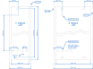

====================================
Mechanical design
====================================

Horizontal rail position and side panel dimensions
=======================================================

The *platform* uses only 3U high subracks. Height of the subrack assembly is ``132.35 mm``.

Width of the subrack is variable. The following rules must be respected:

- one horizontal pitch unit ``HP`` is ``5.08 mm`` wide
- unit width is exactly ``4 HP``, yielding ``20.32 mm``. We call it a *module*.
- the first ``HP`` starts ``2.54 mm`` (``0.5 HP``) from the left
- there is an additional ``0.5 HP`` at the end of the rail

.. figure:: _static/horizontal-rails.svg
	:width: 600pt

	Front horizontal rails with rack-mountable side panels (drawing not to scale)

The resulting horizontal rail length is ``(n * 20.32 + 5.08) mm``, ``n`` being the count of modules
in the subrack assembly. Table below lists some common combinations and rail lengths.

.. table:: Common horizontal rail lengths

	========== =============== ===================== ===============================
	Modules    Width in HP     Rail length in mm     Comment
	========== =============== ===================== ===============================
	10         41              208.28                Size for 10" racks
	21         85              431.80                Size for 19" racks
	========== =============== ===================== ===============================

Side view of the subrack with the corresponding dimensions is pictured below.

.. figure:: _static/side-view.svg
	:width: 600pt

	Side panel with horizontal rails attached, side view

Plug-in unit front panels
==================================

Acceptable thickness of the front panel is 2, 2.5 and 3 mm. Width of the front panel is ``n * 20.32 - 0.30 mm``, where
``n`` is the width of the unit in modules (``20.32 mm``). Nominal width of a 1-module wide plug-in unit is ``20.02 mm``.
Height of the 3U front panel is ``128.4 mm``.

Front panels contain two holes for attaching to a PCB, they are horizontally centered to the second HP from the left.
Vertical distance of the holes is ``99.00 mm``, diameter is ``2.7 mm`` and they are vertically centered.

Close to the bottom PCB holder hole, there are multiple helper holes for the front bracket/holder alignment. These
holes are horizontally displaced ``5.08 mm`` and usually there is one hole to the left and two holes to the right
of the PCB holder hole. See the figure below.

Front panels are attached to the subrack front rails with two ``M2.5`` screws for 1 module wide units and with four
``M2.5`` screws for all wider units. Holes for attachment are horizontally centered in the second HP from the left
(and second HP from the right for 2-module and wider units). Holes are vertically centered and their vertical distance
is ``122.5 mm``.

	Front panel for 1 module wide plug-in unit

Plug-in unit PCB dimensions
=================================

A single plug-in unit comprises of at least these components:

- front panel with the specified design
- front panel bracket/holder to assist with pullting the unit out of the subrack
- two PCB holders
- one or more backplane connectors on the back
- PCB

For more elaborate designs there may be more components in a single unit, eg. multiple PCB holders when more than one
PCB is used, helper connectors, PCB cover, etc.

	Dimensions of a plug-in unit main PCB

