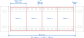

====================================
Mechanical design
====================================

Dimensions
======================

The *platform* uses only 3U high subracks. Height of the subrack assembly is ``132.35 mm``.

Width of the subrack is variable. The following rules must be respected:

- one horizontal pitch unit ``HP`` is ``5.08 mm`` wide
- unit width is exactly ``4 HP``, yielding ``20.32 mm``. We call it a *module*.
- the first ``HP`` starts ``2.54 mm`` (``0.5 HP``) from the left
- there is an additional ``0.5 HP`` at the end of the rail

	Front horizontal rails with rack-mountable side panels (drawing not to scale)

The resulting horizontal rail length is ``(n * 20.32 + 5.08) mm``, ``n`` being the count of modules
in the subrack assembly. Table below lists some common combinations and rail lengths.

.. table:: Common horizontal rail lengths

	========== =============== ===================== ===============================
	Modules    Width in HP     Rail length in mm     Comment
	========== =============== ===================== ===============================
	10         41              208.28                Size for 10" racks
	21         85              431.80                Size for 19" racks
	========== =============== ===================== ===============================

Side view of the subrack with the corresponding dimensions is pictured below.

	Side panel with horizontal rails attached, side view
